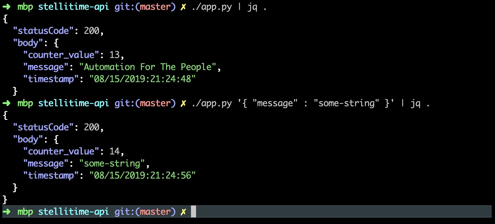

# stellitime-api 

## Small sample CLI program to facilitate discussions

### Description

./app.py invokes a get() or post() operation, depending on absense or presence of a payload argument consisting of a JSON payload containing a "message" string property.

The counter value is stored in a DynamoDB table that has a single row with `id` and `counter_value` attributes.  The key field `id` can be overridden by `export COUNTER_KEY=some-key`.  

 * the `get()` function returns a JSON payload: 
    * current time 
    * current counter_value from the DynamoDB table
    * and the message `Automation For The People`

 * the `put()` function takes a JSON payload containing a `message` property as input, and also returns a JSON payload: 
    * current time 
    * incremented counter_value from the DynamoDB table
    * and a copy of message that was passed on the command line.
 
## Setup:

Type `make all` to:
 * install python3 prerequisites stored in `requirements.txt`
 * deploy a tiny Cloudformation stack creating the DynamoDB table.

## Example Usage:

 * The retrieve the current time and the current counter value (the `get()` function):
    ```
    ./app.py
    ```
 * To echo an arbitary message, and increment the counter (the `put()` function):
    ```
    ./app.py '{ "message" : "some-string" }' 
    ```

### Example Output

<div style='margin-left: 3rem;'>
    
    (colorization courtesy of `jq`)
</div>


